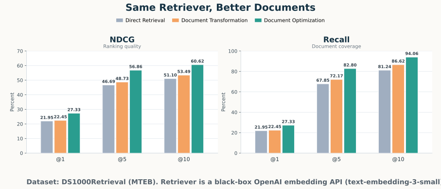
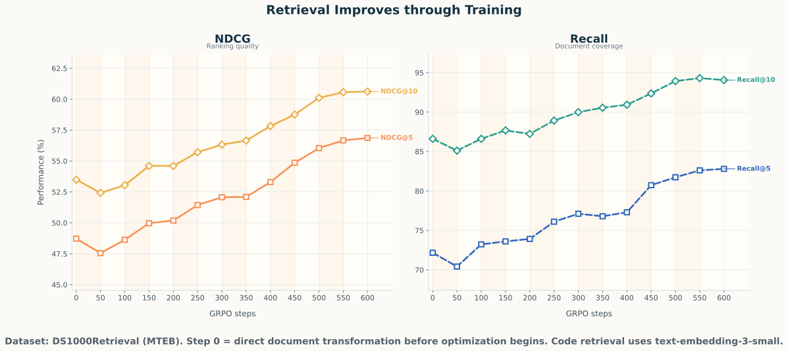

<h1 align="center">DocOpt</h1>

<p align="center">
  
</p>

<p align="center">
  Document Optimization for Black-Box Retrieval via Reinforcement Learning
</p>

<p align="center">
  <a href="https://arxiv.org/abs/2604.05087">
    
  </a>
  <a href="LICENSE">
    
  </a>
</p>

Official repository for the paper [Document Optimization for Black-Box Retrieval via Reinforcement Learning](https://arxiv.org/abs/2604.05087).

This repository contains the current reproduction code for document optimization on the [DS1000Retrieval dataset](https://huggingface.co/datasets/mteb/DS1000Retrieval). The implementation uses OpenAI embeddings for retrieval and a vLLM-backed causal language model for document rewriting and GRPO training.

We are activley working on extending the support of this repo to additional retrievers, datasets and models. Stay tuned!

## Prerequisites

- Python `3.13`
- A GPU for the vLLM and GRPO stages. Development was done using a single H200. A100/H100s should work with reduced batch sizes.
- `OPENAI_API_KEY` for embedding generation

## Install

```bash
uv venv
source .venv/bin/activate
uv pip install -r requirements.txt
uv pip install -e .
```

## Dataset

The reproduction config expects a local dataset root at `data/DS1000Retrieval` with this layout:

- `data/DS1000Retrieval/texts/*.txt`
- `data/DS1000Retrieval/benchmark/benchmark.csv`

You can also run custom experiments with another dataset prepared in the same format.

## Run

```bash
cp .env.example .env
doc-opt run
```

The CLI loads `configs/default.yaml` by default. You can edit that config directly or point the CLI at another config for custom experiments.

The top-level `reward_function` config selects the GRPO reward. The repo currently supports `ranking` (counterfactual `ndcg@5` delta), `dense` (counterfactual similarity-score delta), and `hybrid` (the average of the ranking and dense rewards). All three combine positive-query gains with `reward_negative_sign` × hard-negative gains (default `-1`, which subtracts negatives).

Each run writes a `run_report.json` with the `direct retrieval`, `direct transformation`, `refresh`, and `document optimization` stages, along with `ndcg@{1,5,10}` and `recall@{1,5,10}` metrics.

## Reproduce

The checked-in default config is `configs/default.yaml`. It writes outputs under `artifacts/ds10k/`.

A sample report is checked in at `artifacts/ds10k/run_report.json`. It captures an optimization run on `DS1000Retrieval` through 600 GRPO steps.

In that run:
- baseline retrieval reaches `ndcg@5 = 0.4669` and `recall@5 = 0.6785`
- direct document transformation reaches `ndcg@5 = 0.4873` and `recall@5 = 0.7217`
- after 600 optimization steps, performance improves to `ndcg@5 = 0.5686` and `recall@5 = 0.8280`



_Figure generated from `artifacts/ds10k/run_report.json` using `scripts/plot_run_report.py`._



_Figure generated from `artifacts/ds10k/run_report.json` using `scripts/plot_run_report_steps.py`._

## Citation

If you use this repository, please cite:

```bibtex
@misc{uzan2026documentoptimizationblackboxretrieval,
      title={Document Optimization for Black-Box Retrieval via Reinforcement Learning}, 
      author={Omri Uzan and Ron Polonsky and Douwe Kiela and Christopher Potts},
      year={2026},
      eprint={2604.05087},
      archivePrefix={arXiv},
      primaryClass={cs.CL},
      url={https://arxiv.org/abs/2604.05087}, 
}
```
